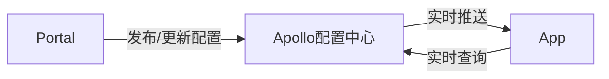

# LLVM tutorial in C++ 

This tutorial is a work in process and because my job in the future will be related with LLVM (Front-end or Back-end, whatever). And hope that this will help beginner to learn LLVM.
Finally, i named my language as "L" language. And i will put in more interesting things. 

Let's Start :)

## Table of Contents

*	[Chapter #1 Introduction](#chapter-1-introduction)
	* [Basic Procedure of Compiling a program](#Basic-Procedure-of-Compiling-a-program)
	* [The Project Structure](#the-project-structure)
	* [Environment](#Environment)
	* [TODO List](#TODO-List)

*	[Chapter #2 Lexer](#chater-2-Lexer)
	* 

## Chapter #1 Introduction

This tutorial showing how to implement your own language step by step. Assumes that you have already know C++, you just need some basic knowledge, go deeper is better :) 

At first, you need to know how to compile the compiled language(like C/C++, not Python). 
The procedure are showing below:

	
